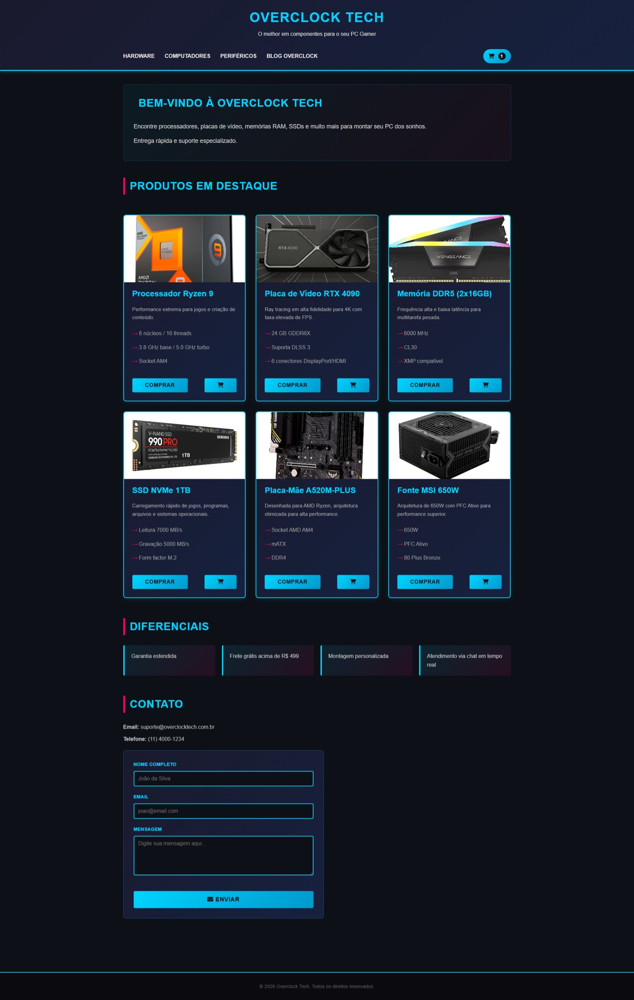
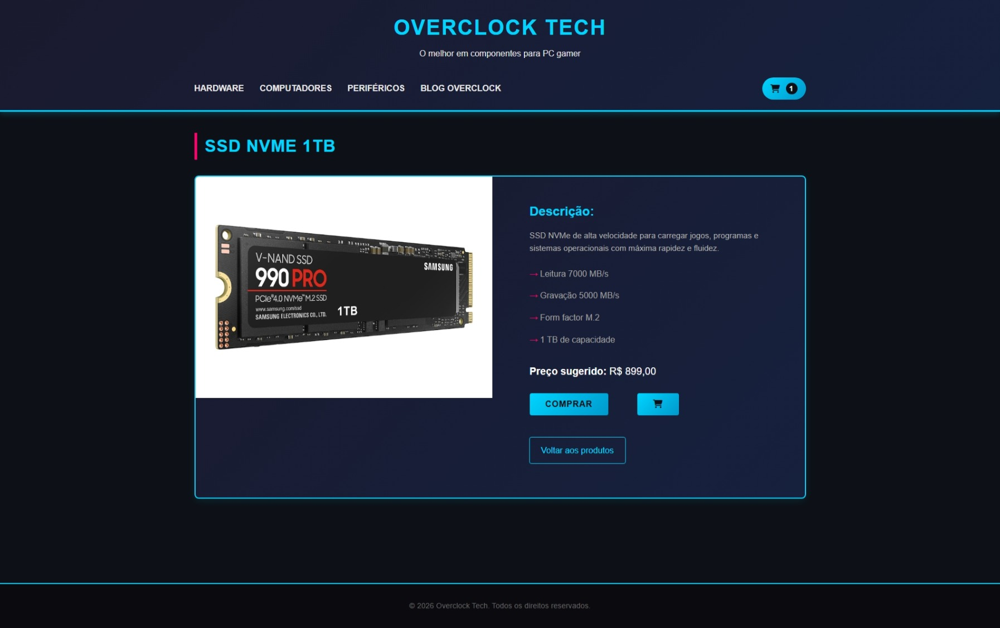

# Overclock Tech - Hardware para Computadores

## O melhor em componentes para o seu PC Gamer

Projeto pessoal baseado no conteúdo aprendido após a finalização da **Masterclass: Do zero ao primeiro website com IA** da Alura. O objetivo foi criar uma landing page de e-commerce moderna, com foco em alta performance e estética gamer.

[:rocket: Confira o resultado final](https://danylomoraes.github.io/overclock-tech/)

### Tecnologias e Ferramentas

- **Editor de Código:** Visual Studio Code
- **Assistente de IA:** Copilot Free (utilizado para geração de estrutura e auxílio no CSS)
- **Linguagens:** HTML5 e CSS3 (Design Responsivo)

### Funcionalidades da Interface

- **Navegação Estruturada:** Menu superior com seções para Hardware, Computadores, Periféricos e Blog.
- **Vitrine de Produtos:** Cards detalhados com especificações técnicas (como o Ryzen 9 e a RTX 4090) e botões de ação rápida.
- **Diferenciais do Negócio:** Destaque para frete grátis, montagem personalizada e garantia estendida.
- **Conversão:** Formulário de contato integrado para suporte e dúvidas.

## Interface Inicial do Projeto Finalizado

## Página de Visualização do Produto Finalizado

